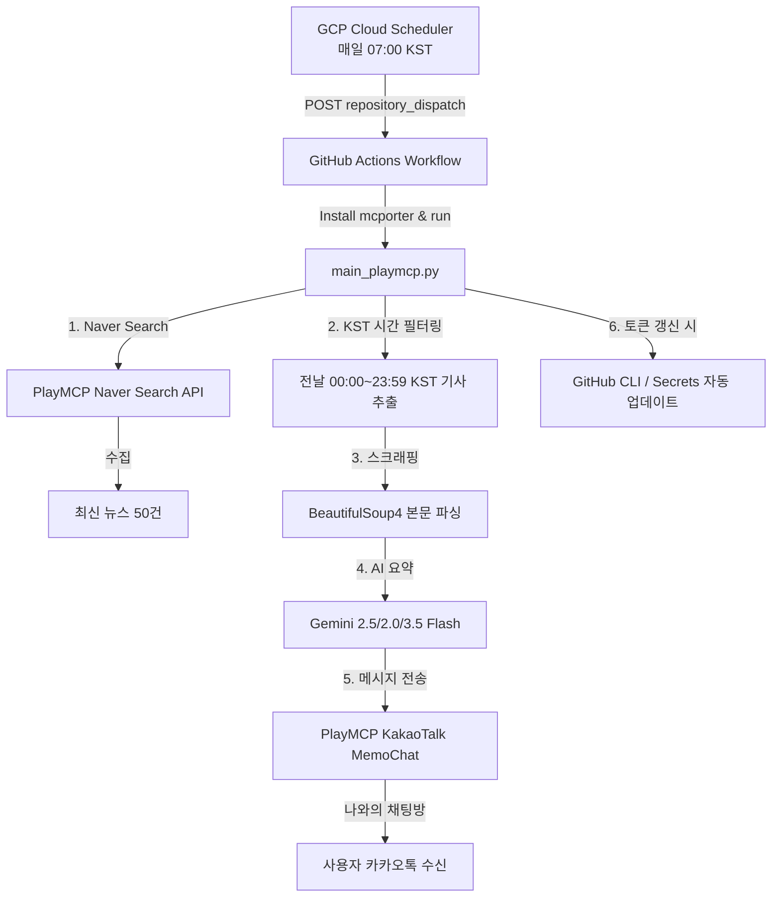

# 작업지시서: 병무청 AI 뉴스 브리핑 자동화 파이프라인

본 문서는 **병무청(MMA) 관련 일일 뉴스 브리핑 자동 전송 시스템**의 전체 아키텍처, 연동 이력, 소스코드 구조 및 향후 운영 관리 지침을 정리한 작업지시서(가이드라인)입니다.

---

## 1. 프로젝트 개요 (Project Overview)

- **목적**: 매일 아침 전날의 주요 병무청 뉴스를 스크래핑하고 AI(Gemini)로 핵심 요약하여, 사용자의 카카오톡("나와의 채팅방")으로 자동 전송하는 100% 서버리스 파이프라인 구축.
- **주요 기술 스택**:
  - **Runtime**: Python 3.10
  - **Gateway**: PlayMCP (`mcporter` CLI)를 활용한 카카오톡 및 네이버 검색 API 인터페이스 연동.
  - **AI Model**: Google Gemini API (`gemini-2.5-flash` 및 무료 등급 모델 군).
  - **Scheduler**: GCP Cloud Scheduler (매일 07:00 KST 실행).
  - **Executor**: GitHub Actions (무상 러너 환경 실행 및 동적 토큰 회전 업데이트).

---

## 2. 시스템 아키텍처 및 동작 메커니즘

### 상세 작동 원리
1. **트리거**: GCP Cloud Scheduler가 지정된 시간(오전 7시 KST)에 GitHub Actions API를 호출해 `repository_dispatch` 이벤트를 발생시킵니다.
2. **뉴스 검색 및 전날 필터링**: 네이버 검색 도구로 최신 뉴스 50건을 수집한 뒤, 한국 표준시(KST) 기준 **전날 00:00 ~ 23:59**에 작성된 기사만 필터링합니다. (주말/휴일 등 전날 기사가 없을 시 최신 검색 기사로 자동 대체됩니다.)
3. **요약 대상 선정**: 필터링된 기사 중 **최대 10개**를 선정해 본문을 크롤링합니다.
4. **Gemini AI 요약 및 중복 제거**:
    - 10개의 기사 본문을 모아 제미나이에 전달하면, AI가 중복/유사 기사들을 스스로 판단하여 고유한 대표 뉴스 스토리로 합산합니다. (총 뉴스 개수는 최대 10개로 제한)
    - 각 고유 소식마다 **1~2문장(단락당 40자 이내)의 극도로 짧은 대화체**로 요약하고, 바로 다음 줄에 해당 뉴스의 **원본 URL 링크만 단독으로 추가**합니다. ('기사 보기:' 같은 접두사나 불필요한 기호는 완전히 배제)
    - **카카오톡 1,000자 제한**에 걸려 메시지가 잘리는 현상을 방지하기 위해 전체 요약문(링크 포함)의 길이를 엄격히 **950자 이하**로 제한하여 제어합니다.
5. **다중 모델 백업 및 자동 재시도 (Robust Fallback)**:
    - 무료 등급(Free Tier)의 트래픽 집중에 대응하기 위해 `gemini-2.5-flash`, `gemini-2.5-flash-lite`, `gemini-2.0-flash`, `gemini-3.5-flash` 순서로 자동 대체 작동하도록 구성하였습니다.
    - 일시적인 `503 Unavailable` 오류 발생 시 지수 백오프 방식(Exponential Backoff)으로 자동 재시도합니다.
6. **카카오톡 발송 및 토큰 관리**:
    - PlayMCP의 `KakaotalkChat-MemoChat` 도구를 실행해 사용자 카카오톡으로 전송합니다.
    - 전송 과정 중 카카오/PlayMCP 토큰이 동적 회전(Rotation)되어 재발급되면, 스크립트가 GitHub CLI를 사용해 리포지토리 시크릿(`PLAYMCP_ACCESS_TOKEN`, `PLAYMCP_REFRESH_TOKEN`)을 자동 갱신합니다.

---

## 3. 구축 및 트러블슈팅 이력 (Troubleshooting History)

개발 및 연동 과정에서 해결한 주요 이슈 목록입니다:

1. **PowerShell 인자 생략 및 이스케이프 이슈**:
   - **증상**: 윈도우 환경에서 문자열 인자에 포함된 공백과 쌍따옴표가 소실되어 명령어가 깨지는 현상.
   - **해결**: Python의 `subprocess.run(..., shell=False)` 리스트 인수 구조를 채택하고, CLI 실행 시 positional 인자 대신 표준화된 JSON 페이로드 플래그인 `--args`를 전면 도입하여 문자 형식을 완벽하게 보호했습니다.
2. **Gemini 결제 소진 오류 (429 Resource Exhausted)**:
   - **증상**: 제공된 제미나이 API Key에 충전된 선결제 크레딧이 없어 모든 호출이 전면 마비됨.
   - **해결**: `gcloud` SDK를 이용해 사용자의 GCP 프로젝트 전체를 자동 스캔하여, 결제 계정이 묶이지 않아 **완전 무료(Free Tier) 등급으로 상시 호출 가능한 키(`AIzaSyBCfit...`)를 발급·탐지**해 적용했습니다.
3. **카카오톡 1,000자 전송 잘림 및 형식 가독성 이슈**:
   - **증상**: 요약 기사가 15개로 늘어나고 내용이 길어지자 카카오톡 수신 메시지가 1,000자째에(`https://www.danbinews.com/ne...`) 완전히 뚝 끊겨 오는 현상. 또한 불필요한 '기사 보기:' 접두사가 메시지를 너저분하게 만듦.
   - **해결**: 기사 추출 개수를 10개로 줄이고 각 기사의 요약을 1~2문장(40자 이내)의 극단적으로 짧은 단락으로 축소하였으며, '기사 보기:' 등의 불필요한 문구를 배제하여 순수 URL만 표기함으로써 전체 메시지 길이가 950자 이하로 안전하게 수신되도록 수정하였습니다.

---

## 4. 소스코드 구성 파일 정보

* **[.github/workflows/daily_briefing.yml](file:///c:/gemini/new/.github/workflows/daily_briefing.yml)**: 깃허브 액션 파이프라인 정의 파일.
* **[mma-news-briefing/main_playmcp.py](file:///c:/gemini/new/mma-news-briefing/main_playmcp.py)**: 뉴스 검색, 전날 필터링, 크롤링, 다중 모델 제미나이 요약, PlayMCP 카카오 발송 및 토큰 업데이트를 통합 관리하는 핵심 자동화 코드.
* **[mma-news-briefing/upload_to_github.py](file:///c:/gemini/new/mma-news-briefing/upload_to_github.py)**: 로컬 소스코드를 GitHub API를 통해 동기화 업로드해 주는 배포 스크립트.

---

## 5. 향후 유지보수 및 운영 지침

1. **GCP 스케줄러 상태**: `daily-mma-news-trigger` 스케줄러가 정상 작동 중입니다. 스케줄러 계정 정보는 `gcloud`를 통해 로그인된 상태로 안전하게 연동되어 있습니다.
2. **PlayMCP 인증 관리**: 카카오톡 토큰 만료를 방지하기 위해 `main_playmcp.py`가 자동으로 토큰을 매일 갱신 및 백업합니다. 만약 갱신 주기를 초과하여 토큰이 완전 만료되는 경우, PlayMCP에서 OTT(One Time Token)를 재발급받아 `configure_credentials.py` 또는 리포지토리 시크릿을 한 번만 재연동해 주시면 됩니다.
3. **무료 등급 한도**: 하루 1회 호출하므로 한도 초과 위험은 전혀 없으나, 다른 용도로 무료 API 키를 대량 호출할 경우 당일의 브리핑 요약 작동이 잠시 멈출 수 있으므로 해당 키의 일상 사용은 분당 15회 이내로 권장합니다.
